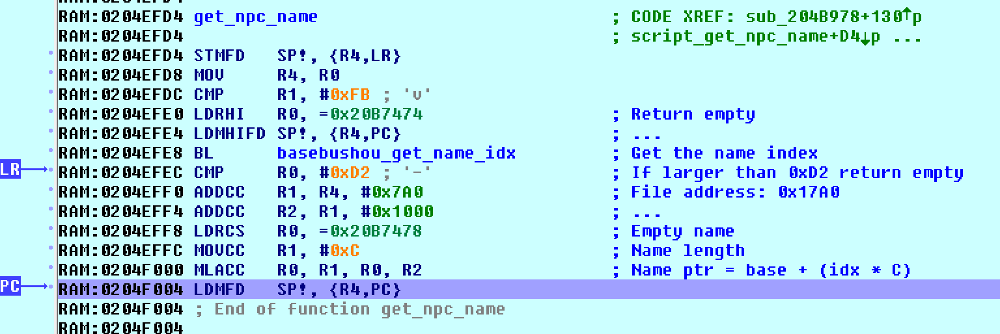

> Research in the game Pokémon Conquest from NDS to get the location of the NPC
> names and the relationship with each dialog box

## Intro

Pokémon Conquest (NDS) is one of the games I would like to translate to Spanish.
I have already created almost all the tools to extract, modify and insert the
content. This time, I would like to focus in the story dialogs. Below is one
example:

```plain
{char:0058}{speaker_color:2}{char_img:0}
Hey, you!{wait:48}20 You're {name1}, right? {color:49}Aurora{color:51}'s new
Warlord?
```

If you take a closer look you will notice we are missing something: **we don't
know the name of the character speaking**. This is a very important information
for translators, because otherwise they are out of context. For instance, they
won't know the gender of the person speaking (in Spanish we have male and female
version of nouns and adjectives).

So let's try to figure out where are the names and how we can relate them to
each dialog.

## The location of the names

First, let's find out where are the names inside the game files. I will pick the
name of the person speaking in the example dialog: `Koroku`. So let's open the
game with an hexadecimal editor (I like [HxD](https://mh-nexus.de/en/hxd/)) and
search the text. The search returns that the text is located at `0x00185134`. We
just need to know which game file is at that address. The easier method is to
use [Tinke](https://github.com/pleonex/tinke/). We open the game with this
program and type in the search box the magic words: `Offset: 00185134`. It will
show us at this address we have the file **`BaseBushou.dat`**.


We ran a quick test that this is indeed the file and field that we need to
change by editing the name and importing back the file into the game.


Voilà. As you can see I changed in the file the name `Koroku` with `Pleonet` and
now the latter is showing as the character speaking.

## Matching the dialog with the name

We know the file that contains the list of names. This is useful in case we want
to change them. But we don't know who is speaking in the dialog yet. Let's check
again the raw dialog text:

```plain
{char:0058}{speaker_color:2}{char_img:0}
Hey, you!{wait:48}20 You're {name1}, right? {color:49}Aurora{color:51}'s new
Warlord?
```

There are a couple of interesting metadata in that dialog. In the actual game
file they have binary bytes, but after some try-and-see changes I was able to
determine that:

- By changing the first `00058` control code, the name of the person speaking
  changes. So I named it `char` from _character_.
- The second control code, `2` in some cases changes the color of the person
  speaking changes. So `speaker_color`.
- Finally, the third control code must be the sprite of the NPC. There are
  several per person to show different emotions, so I named it `char_img`.

Clearly, the control code we should investigate further is the first one.
Somehow the number `0058` is related to the text `Koroku`. We just need to know
what kind of algorithm the game follows to get the text from the number. It's
time to do some disassembly.


As always, the easier method is to play until the game shows the dialog. Then,
we search the text in the memory and put a read-breakpoint in the control code
`char` (in binary `1B 40`), so we can start following the game logic to
associate the number with the name. In my case the search returned three copies
of the text: `0x020C3B66`, `0x020C4942` and `0x02263D4E`. So three breakpoint
since we can't be sure which one the game will actually process.

The first one we expect to break is the third breakpoint because it contains the
whole script in memory. This is probably the script file in memory. And from
this location it will copy the text to another temporary places. And exactly as
expected, I see that the game breaks there to copy our first control code
argument `0058` into the temporary memory place (the stack): `0x02FE2F38`. One
more breakpoint there.

From the copy in the stack, it copies now the text into the already-known
location of our second breakpoint. So we continue, and the game starts doing
something more interesting as shown below:


This small algorithm convert the text into a number. The logic is simple: it
substract each char `0x30` which is `0` in ASCII. So, `5` in ASCII is `0x35`
minus `0x30` is `5`. It's this simple to convert a char into a number. Then it
multiply the current result by 10 to move the result to the left and adds the
next number.

The method iterates to try to find three control codes: `1B 40`, `1B 73` and
`1B 66`. In order, they correspond to my named control codes: `char`,
`speaker_color` and `char_img`. We found the subrouting that parse the first
three control code that each dialog usually have. If the method is able to parse
and convert each argument into a number, it stores the result in three output
registers. For our number of interest, the result goes to another stack address:
`0x02FE2F94`. Let's follow now this one.

The address was coming from the stack because is a variable from the caller
(`SP + 0x14`). The first thing it does is to fail if the number is larger than
`0x270F`. Then, it calls again the previous subroutine to parse the numbers,
because why not making the game a bit slower? Hands in the next subroutine where
it compares our number with `0x3E8`, gets the pointer to `0x022797F0` and go
deep into the next function. The pointer seems to point to a game file, let's
try to find it... And yes, it's the file `ScenarioBushou.dat`.


Our target argument number is actually an index. The game multiplies this number
by 0x20 and reads four bytes: `88021264`. It removes bits with bitwise shifts so
it gets the bits from 17 to 21, in our case just `1`. And... it does nothing
with the result. :frowning: :expressionless:

Back to the caller, there is still one more place where it can use our number. A
few lines after, it checks if the number is between 0 and 1000. If this is the
case, it gets again the pointer to `ScenarioBushou.dat` and call a new function:
`0204FB80`.

It checks if the number is larger than `0xD1`, if that's the case it returns an
empty string `\0`. It gets again our four bytes flag field, but this time it
gets the first 9 bits: `64`. And just, before finishing this function, it gets
the pointer to the file `BaseBushou` and start doing _things_.

If the number from the flag field is less than `0xFB`, it multiplies the number
by `0x14` and read four bytes from the file at that location (address: `0x7D0`,
content: `00967575`). It gets the bits from 17 to 25 which is `0x4B`. Now, from
the file position `0x17A0`, it jumps to this last number multiply by `0x0C`:
`0x02279188`.

Remember this address? Yes! It's pointing to our NPC name. Finally!



## Summary

This was a chaos of parsing and reading unncessary files and fields but at the
end the logic is simple. The argument of the control code in the dialog text
(`0058`) is the index to an structure with fixed length 32 bytes in
`ScenarioBushou.dat`. We are interested in the first 9 bits of this structure.
So we multiply `0058` by `0x20` and get the first 9 bits: `0x64`. This is the
index to another structure in `BaseBushou.dat` of fixed length 20 bytes. We
multiply this second index by `0x14` and get the name index by reading the bits
17-25: `0x4B`. The name will be starting at `0x17A0` multiplying the name index
by the name lengths (`0x0C`).


